# FR-01 and FR-02 PlantUML Sources

Complete sources for the revised scenario set. The neighboring PNG files are the reviewed exports. Figure IDs and use-case references follow the revised guide; these are requirements/design diagrams, with implementation distinctions documented in README.md.

## UC-01 Organization management

Source: [Use Case/UC-01-Organizations.puml](<Use Case/UC-01-Organizations.puml>) · [PNG](<Use Case/UC-01-Organizations.png>)

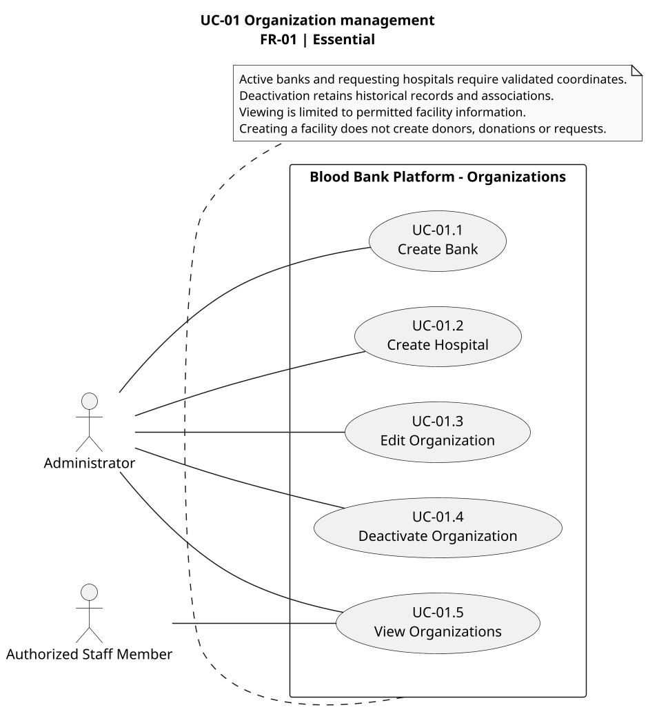
```plantuml
@startuml UC01_Organizations
title UC-01 Organization management\nFR-01 | Essential
skinparam monochrome true
skinparam shadowing false
skinparam defaultFontName Arial
skinparam defaultFontSize 14
skinparam ArrowFontSize 13
skinparam noteFontSize 12
skinparam dpi 140
left to right direction
skinparam packageStyle rectangle
actor "Administrator" as Admin
actor "Authorized Staff Member" as Staff
rectangle "Blood Bank Platform - Organizations" as Platform {
 usecase "UC-01.1\nCreate Bank" as Bank
 usecase "UC-01.2\nCreate Hospital" as Hospital
 usecase "UC-01.3\nEdit Organization" as Edit
 usecase "UC-01.4\nDeactivate Organization" as Deactivate
 usecase "UC-01.5\nView Organizations" as View
}
Admin -- Bank
Admin -- Hospital
Admin -- Edit
Admin -- Deactivate
Admin -- View
Staff -- View
note bottom of Platform
 Active banks and requesting hospitals require validated coordinates.
 Deactivation retains historical records and associations.
 Viewing is limited to permitted facility information.
 Creating a facility does not create donors, donations or requests.
end note
@enduml
```

## UC-02 Identity and staff permissions

Source: [Use Case/UC-02-Identity.puml](<Use Case/UC-02-Identity.puml>) · [PNG](<Use Case/UC-02-Identity.png>)

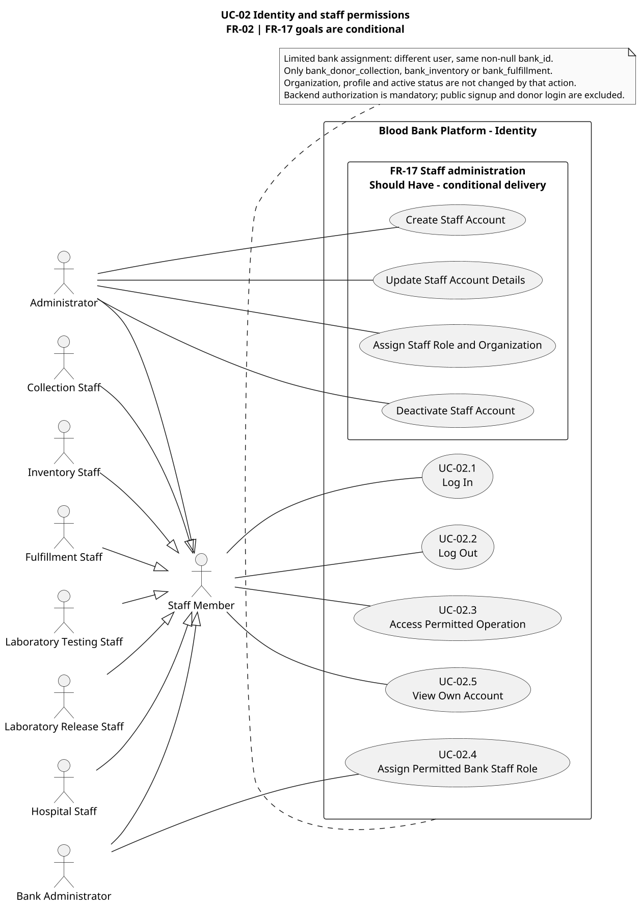
```plantuml
@startuml UC02_Identity
title UC-02 Identity and staff permissions\nFR-02 | FR-17 goals are conditional
skinparam monochrome true
skinparam shadowing false
skinparam defaultFontName Arial
skinparam defaultFontSize 14
skinparam ArrowFontSize 13
skinparam noteFontSize 12
skinparam dpi 140
left to right direction
skinparam packageStyle rectangle
actor "Staff Member" as Staff
actor "Administrator" as Admin
actor "Bank Administrator" as BA
actor "Collection Staff" as Collection
actor "Inventory Staff" as Inventory
actor "Fulfillment Staff" as Fulfillment
actor "Laboratory Testing Staff" as Testing
actor "Laboratory Release Staff" as Release
actor "Hospital Staff" as Hospital
Admin --|> Staff
BA --|> Staff
Collection --|> Staff
Inventory --|> Staff
Fulfillment --|> Staff
Testing --|> Staff
Release --|> Staff
Hospital --|> Staff
rectangle "Blood Bank Platform - Identity" as Platform {
 usecase "UC-02.1\nLog In" as Login
 usecase "UC-02.2\nLog Out" as Logout
 usecase "UC-02.3\nAccess Permitted Operation" as Access
 usecase "UC-02.5\nView Own Account" as Own
 usecase "UC-02.4\nAssign Permitted Bank Staff Role" as Assign
 package "FR-17 Staff administration\nShould Have - conditional delivery" {
  usecase "Create Staff Account" as Create
  usecase "Update Staff Account Details" as Update
  usecase "Assign Staff Role and Organization" as GeneralAssign
  usecase "Deactivate Staff Account" as Deactivate
 }
}
Staff -- Login
Staff -- Logout
Staff -- Access
Staff -- Own
BA -- Assign
Admin -- Create
Admin -- Update
Admin -- GeneralAssign
Admin -- Deactivate
note bottom of Platform
 Limited bank assignment: different user, same non-null bank_id.
 Only bank_donor_collection, bank_inventory or bank_fulfillment.
 Organization, profile and active status are not changed by that action.
 Backend authorization is mandatory; public signup and donor login are excluded.
end note
@enduml
```

## SQ-01A Create bank

Source: [Sequence/SQ-01A-CreateBank.puml](<Sequence/SQ-01A-CreateBank.puml>) · [PNG](<Sequence/SQ-01A-CreateBank.png>)

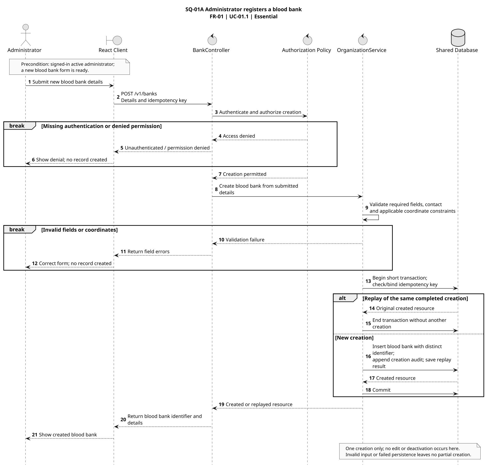
```plantuml
@startuml SQ01A_Create
title SQ-01A Administrator registers a blood bank\nFR-01 | UC-01.1 | Essential
skinparam monochrome true
skinparam shadowing false
skinparam defaultFontName Arial
skinparam defaultFontSize 14
skinparam ArrowFontSize 13
skinparam noteFontSize 12
skinparam dpi 140
hide footbox
skinparam maxMessageSize 240
autonumber
actor Administrator as Admin
boundary "React Client" as Client
control "BankController" as Ctrl
control "Authorization Policy" as Policy
control "OrganizationService" as Svc
database "Shared Database" as DB
note over Admin, Client
 Precondition: signed-in active administrator;
 a new blood bank form is ready.
end note
Admin -> Client: Submit new blood bank details
Client -> Ctrl: POST /v1/banks\nDetails and idempotency key
Ctrl -> Policy: Authenticate and authorize creation
break Missing authentication or denied permission
 Policy --> Ctrl: Access denied
 Ctrl --> Client: Unauthenticated / permission denied
 Client --> Admin: Show denial; no record created
end
Policy --> Ctrl: Creation permitted
Ctrl -> Svc: Create blood bank from submitted details
Svc -> Svc: Validate required fields, contact\nand applicable coordinate constraints
break Invalid fields or coordinates
 Svc --> Ctrl: Validation failure
 Ctrl --> Client: Return field errors
 Client --> Admin: Correct form; no record created
end
Svc -> DB: Begin short transaction;\ncheck/bind idempotency key
alt Replay of the same completed creation
 DB --> Svc: Original created resource
 Svc -> DB: End transaction without another creation
else New creation
 Svc -> DB: Insert blood bank with distinct identifier;\nappend creation audit; save replay result
 DB --> Svc: Created resource
 Svc -> DB: Commit
end
Svc --> Ctrl: Created or replayed resource
Ctrl --> Client: Return blood bank identifier and details
Client --> Admin: Show created blood bank
note over Svc, DB
 One creation only; no edit or deactivation occurs here.
 Invalid input or failed persistence leaves no partial creation.
end note
@enduml
```

## SQ-01B Create hospital

Source: [Sequence/SQ-01B-CreateHospital.puml](<Sequence/SQ-01B-CreateHospital.puml>) · [PNG](<Sequence/SQ-01B-CreateHospital.png>)

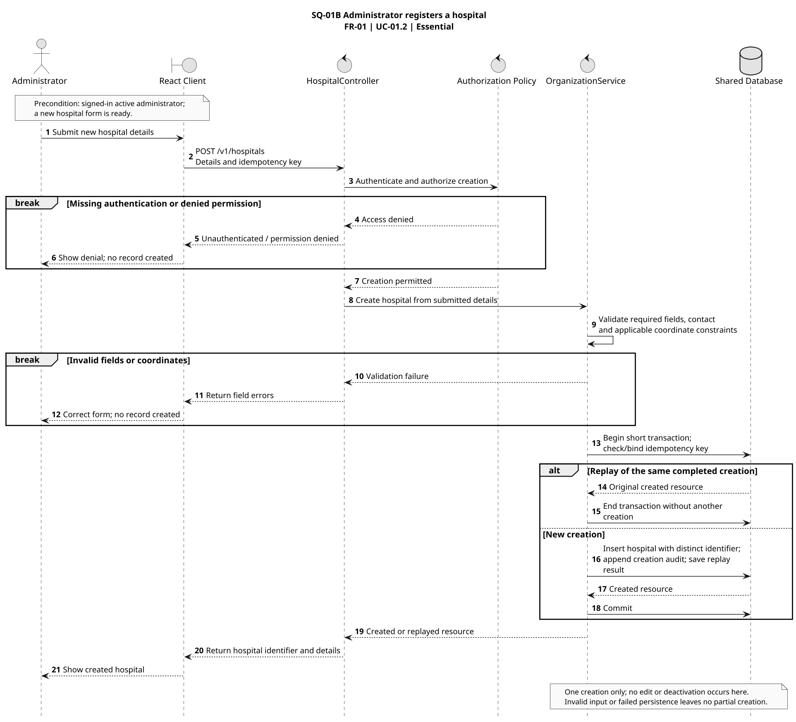
```plantuml
@startuml SQ01B_Create
title SQ-01B Administrator registers a hospital\nFR-01 | UC-01.2 | Essential
skinparam monochrome true
skinparam shadowing false
skinparam defaultFontName Arial
skinparam defaultFontSize 14
skinparam ArrowFontSize 13
skinparam noteFontSize 12
skinparam dpi 140
hide footbox
skinparam maxMessageSize 240
autonumber
actor Administrator as Admin
boundary "React Client" as Client
control "HospitalController" as Ctrl
control "Authorization Policy" as Policy
control "OrganizationService" as Svc
database "Shared Database" as DB
note over Admin, Client
 Precondition: signed-in active administrator;
 a new hospital form is ready.
end note
Admin -> Client: Submit new hospital details
Client -> Ctrl: POST /v1/hospitals\nDetails and idempotency key
Ctrl -> Policy: Authenticate and authorize creation
break Missing authentication or denied permission
 Policy --> Ctrl: Access denied
 Ctrl --> Client: Unauthenticated / permission denied
 Client --> Admin: Show denial; no record created
end
Policy --> Ctrl: Creation permitted
Ctrl -> Svc: Create hospital from submitted details
Svc -> Svc: Validate required fields, contact\nand applicable coordinate constraints
break Invalid fields or coordinates
 Svc --> Ctrl: Validation failure
 Ctrl --> Client: Return field errors
 Client --> Admin: Correct form; no record created
end
Svc -> DB: Begin short transaction;\ncheck/bind idempotency key
alt Replay of the same completed creation
 DB --> Svc: Original created resource
 Svc -> DB: End transaction without another creation
else New creation
 Svc -> DB: Insert hospital with distinct identifier;\nappend creation audit; save replay result
 DB --> Svc: Created resource
 Svc -> DB: Commit
end
Svc --> Ctrl: Created or replayed resource
Ctrl --> Client: Return hospital identifier and details
Client --> Admin: Show created hospital
note over Svc, DB
 One creation only; no edit or deactivation occurs here.
 Invalid input or failed persistence leaves no partial creation.
end note
@enduml
```

## SQ-01C Update organization

Source: [Sequence/SQ-01C-UpdateOrganization.puml](<Sequence/SQ-01C-UpdateOrganization.puml>) · [PNG](<Sequence/SQ-01C-UpdateOrganization.png>)

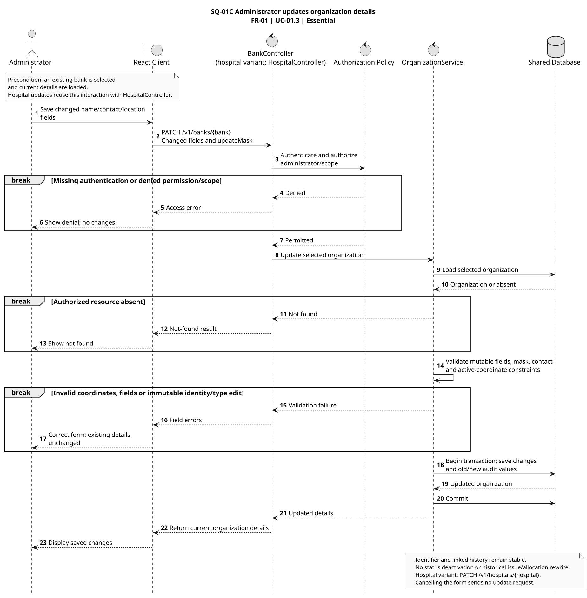
```plantuml
@startuml SQ01C_Update
title SQ-01C Administrator updates organization details\nFR-01 | UC-01.3 | Essential
skinparam monochrome true
skinparam shadowing false
skinparam defaultFontName Arial
skinparam defaultFontSize 14
skinparam ArrowFontSize 13
skinparam noteFontSize 12
skinparam dpi 140
hide footbox
skinparam maxMessageSize 240
autonumber
actor Administrator as Admin
boundary "React Client" as Client
control "BankController\n(hospital variant: HospitalController)" as Ctrl
control "Authorization Policy" as Policy
control "OrganizationService" as Svc
database "Shared Database" as DB
note over Admin, Client
 Precondition: an existing bank is selected
 and current details are loaded.
 Hospital updates reuse this interaction with HospitalController.
end note
Admin -> Client: Save changed name/contact/location fields
Client -> Ctrl: PATCH /v1/banks/{bank}\nChanged fields and updateMask
Ctrl -> Policy: Authenticate and authorize administrator/scope
break Missing authentication or denied permission/scope
 Policy --> Ctrl: Denied
 Ctrl --> Client: Access error
 Client --> Admin: Show denial; no changes
end
Policy --> Ctrl: Permitted
Ctrl -> Svc: Update selected organization
Svc -> DB: Load selected organization
DB --> Svc: Organization or absent
break Authorized resource absent
 Svc --> Ctrl: Not found
 Ctrl --> Client: Not-found result
 Client --> Admin: Show not found
end
Svc -> Svc: Validate mutable fields, mask, contact\nand active-coordinate constraints
break Invalid coordinates, fields or immutable identity/type edit
 Svc --> Ctrl: Validation failure
 Ctrl --> Client: Field errors
 Client --> Admin: Correct form; existing details unchanged
end
Svc -> DB: Begin transaction; save changes\nand old/new audit values
DB --> Svc: Updated organization
Svc -> DB: Commit
Svc --> Ctrl: Updated details
Ctrl --> Client: Return current organization details
Client --> Admin: Display saved changes
note over Svc, DB
 Identifier and linked history remain stable.
 No status deactivation or historical issue/allocation rewrite.
 Hospital variant: PATCH /v1/hospitals/{hospital}.
 Cancelling the form sends no update request.
end note
@enduml
```

## SQ-01D Deactivate organization

Source: [Sequence/SQ-01D-DeactivateOrganization.puml](<Sequence/SQ-01D-DeactivateOrganization.puml>) · [PNG](<Sequence/SQ-01D-DeactivateOrganization.png>)

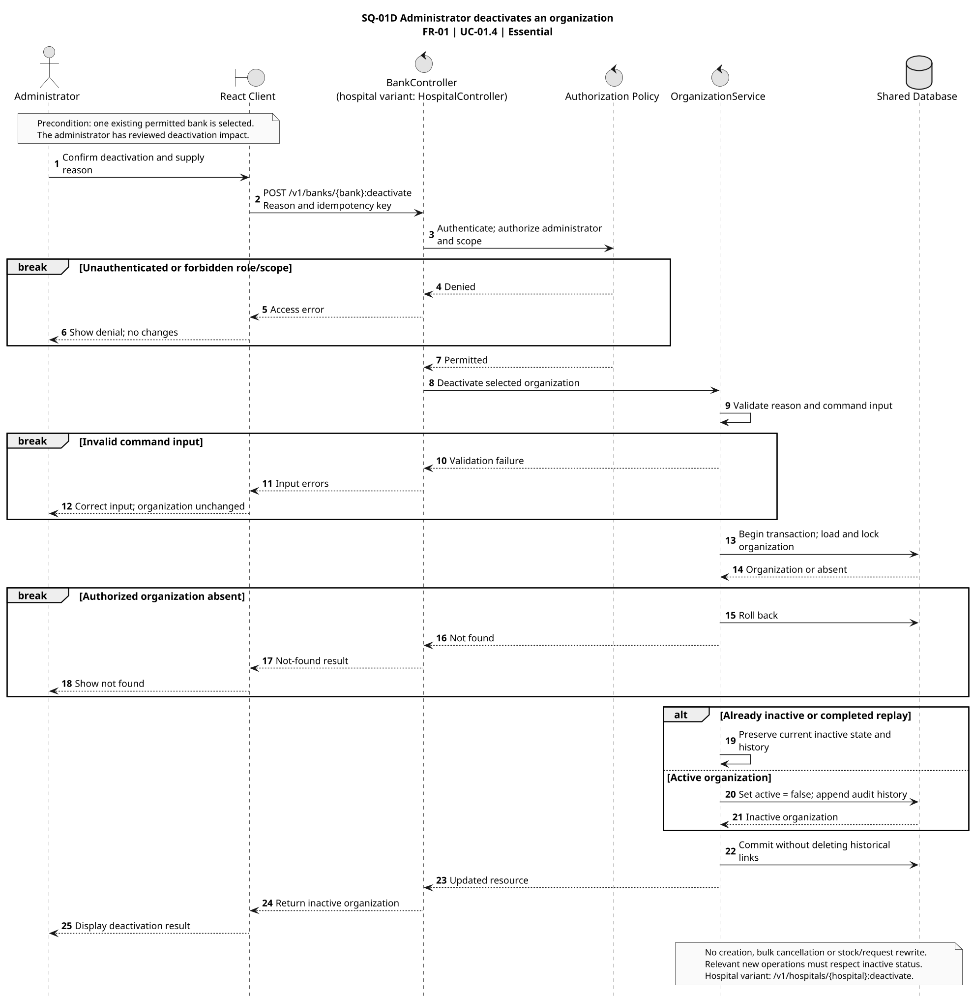
```plantuml
@startuml SQ01D_Deactivate
title SQ-01D Administrator deactivates an organization\nFR-01 | UC-01.4 | Essential
skinparam monochrome true
skinparam shadowing false
skinparam defaultFontName Arial
skinparam defaultFontSize 14
skinparam ArrowFontSize 13
skinparam noteFontSize 12
skinparam dpi 140
hide footbox
skinparam maxMessageSize 240
autonumber
actor Administrator as Admin
boundary "React Client" as Client
control "BankController\n(hospital variant: HospitalController)" as Ctrl
control "Authorization Policy" as Policy
control "OrganizationService" as Svc
database "Shared Database" as DB
note over Admin, Client
 Precondition: one existing permitted bank is selected.
 The administrator has reviewed deactivation impact.
end note
Admin -> Client: Confirm deactivation and supply reason
Client -> Ctrl: POST /v1/banks/{bank}:deactivate\nReason and idempotency key
Ctrl -> Policy: Authenticate; authorize administrator and scope
break Unauthenticated or forbidden role/scope
 Policy --> Ctrl: Denied
 Ctrl --> Client: Access error
 Client --> Admin: Show denial; no changes
end
Policy --> Ctrl: Permitted
Ctrl -> Svc: Deactivate selected organization
Svc -> Svc: Validate reason and command input
break Invalid command input
 Svc --> Ctrl: Validation failure
 Ctrl --> Client: Input errors
 Client --> Admin: Correct input; organization unchanged
end
Svc -> DB: Begin transaction; load and lock organization
DB --> Svc: Organization or absent
break Authorized organization absent
 Svc -> DB: Roll back
 Svc --> Ctrl: Not found
 Ctrl --> Client: Not-found result
 Client --> Admin: Show not found
end
alt Already inactive or completed replay
 Svc -> Svc: Preserve current inactive state and history
else Active organization
 Svc -> DB: Set active = false; append audit history
 DB --> Svc: Inactive organization
end
Svc -> DB: Commit without deleting historical links
Svc --> Ctrl: Updated resource
Ctrl --> Client: Return inactive organization
Client --> Admin: Display deactivation result
note over Svc, DB
 No creation, bulk cancellation or stock/request rewrite.
 Relevant new operations must respect inactive status.
 Hospital variant: /v1/hospitals/{hospital}:deactivate.
end note
@enduml
```

## SQ-01E View organization list

Source: [Sequence/SQ-01E-ViewOrganizations.puml](<Sequence/SQ-01E-ViewOrganizations.puml>) · [PNG](<Sequence/SQ-01E-ViewOrganizations.png>)

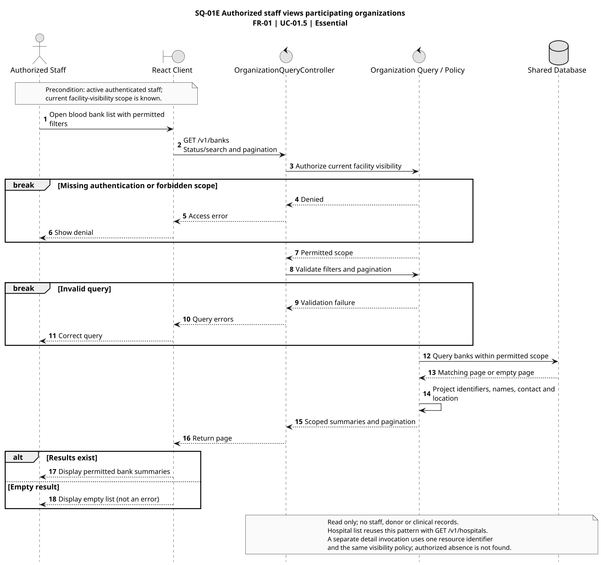
```plantuml
@startuml SQ01E_View
title SQ-01E Authorized staff views participating organizations\nFR-01 | UC-01.5 | Essential
skinparam monochrome true
skinparam shadowing false
skinparam defaultFontName Arial
skinparam defaultFontSize 14
skinparam ArrowFontSize 13
skinparam noteFontSize 12
skinparam dpi 140
hide footbox
skinparam maxMessageSize 240
autonumber
actor "Authorized Staff" as Staff
boundary "React Client" as Client
control "OrganizationQueryController" as Ctrl
control "Organization Query / Policy" as Query
database "Shared Database" as DB
note over Staff, Client
 Precondition: active authenticated staff;
 current facility-visibility scope is known.
end note
Staff -> Client: Open blood bank list with permitted filters
Client -> Ctrl: GET /v1/banks\nStatus/search and pagination
Ctrl -> Query: Authorize current facility visibility
break Missing authentication or forbidden scope
 Query --> Ctrl: Denied
 Ctrl --> Client: Access error
 Client --> Staff: Show denial
end
Query --> Ctrl: Permitted scope
Ctrl -> Query: Validate filters and pagination
break Invalid query
 Query --> Ctrl: Validation failure
 Ctrl --> Client: Query errors
 Client --> Staff: Correct query
end
Query -> DB: Query banks within permitted scope
DB --> Query: Matching page or empty page
Query -> Query: Project identifiers, names, contact and location
Query --> Ctrl: Scoped summaries and pagination
Ctrl --> Client: Return page
alt Results exist
 Client --> Staff: Display permitted bank summaries
else Empty result
 Client --> Staff: Display empty list (not an error)
end
note over Ctrl, DB
 Read only; no staff, donor or clinical records.
 Hospital list reuses this pattern with GET /v1/hospitals.
 A separate detail invocation uses one resource identifier
 and the same visibility policy; authorized absence is not found.
end note
@enduml
```

## SQ-02A Log in

Source: [Sequence/SQ-02-Login.puml](<Sequence/SQ-02-Login.puml>) · [PNG](<Sequence/SQ-02-Login.png>)

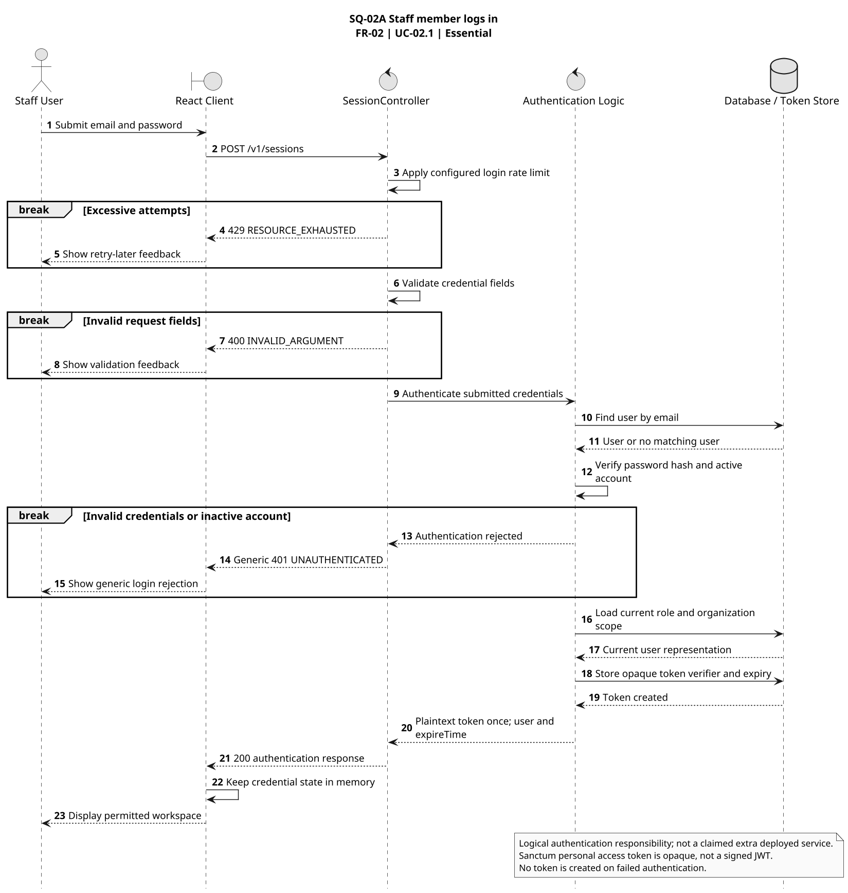
```plantuml
@startuml SQ02A_Login
title SQ-02A Staff member logs in\nFR-02 | UC-02.1 | Essential
skinparam monochrome true
skinparam shadowing false
skinparam defaultFontName Arial
skinparam defaultFontSize 14
skinparam ArrowFontSize 13
skinparam noteFontSize 12
skinparam dpi 140
hide footbox
skinparam maxMessageSize 240
autonumber
actor "Staff User" as Staff
boundary "React Client" as Client
control SessionController as Ctrl
control "Authentication Logic" as Auth
database "Database / Token Store" as DB
Staff -> Client: Submit email and password
Client -> Ctrl: POST /v1/sessions
Ctrl -> Ctrl: Apply configured login rate limit
break Excessive attempts
 Ctrl --> Client: 429 RESOURCE_EXHAUSTED
 Client --> Staff: Show retry-later feedback
end
Ctrl -> Ctrl: Validate credential fields
break Invalid request fields
 Ctrl --> Client: 400 INVALID_ARGUMENT
 Client --> Staff: Show validation feedback
end
Ctrl -> Auth: Authenticate submitted credentials
Auth -> DB: Find user by email
DB --> Auth: User or no matching user
Auth -> Auth: Verify password hash and active account
break Invalid credentials or inactive account
 Auth --> Ctrl: Authentication rejected
 Ctrl --> Client: Generic 401 UNAUTHENTICATED
 Client --> Staff: Show generic login rejection
end
Auth -> DB: Load current role and organization scope
DB --> Auth: Current user representation
Auth -> DB: Store opaque token verifier and expiry
DB --> Auth: Token created
Auth --> Ctrl: Plaintext token once; user and expireTime
Ctrl --> Client: 200 authentication response
Client -> Client: Keep credential state in memory
Client --> Staff: Display permitted workspace
note over Auth, DB
 Logical authentication responsibility; not a claimed extra deployed service.
 Sanctum personal access token is opaque, not a signed JWT.
 No token is created on failed authentication.
end note
@enduml
```

## SQ-02B Log out

Source: [Sequence/SQ-02B-Logout.puml](<Sequence/SQ-02B-Logout.puml>) · [PNG](<Sequence/SQ-02B-Logout.png>)

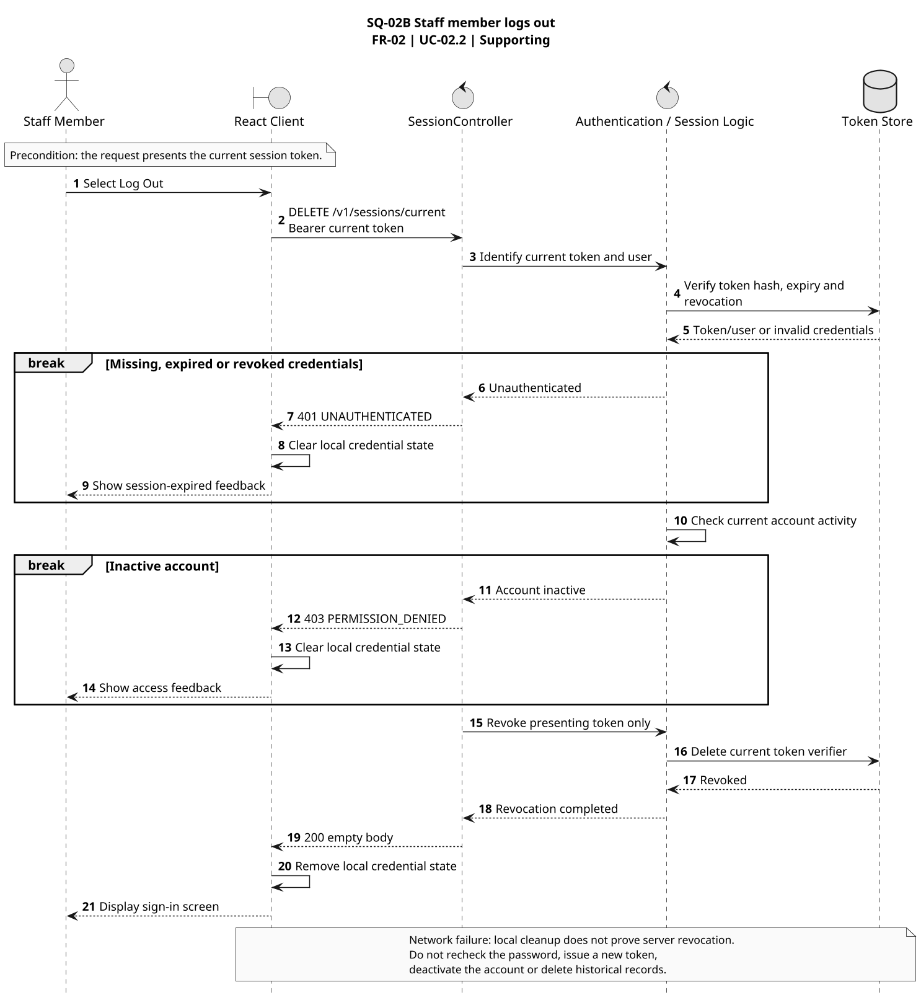
```plantuml
@startuml SQ02B_Logout
title SQ-02B Staff member logs out\nFR-02 | UC-02.2 | Supporting
skinparam monochrome true
skinparam shadowing false
skinparam defaultFontName Arial
skinparam defaultFontSize 14
skinparam ArrowFontSize 13
skinparam noteFontSize 12
skinparam dpi 140
hide footbox
skinparam maxMessageSize 240
autonumber
actor "Staff Member" as Staff
boundary "React Client" as Client
control SessionController as Ctrl
control "Authentication / Session Logic" as Session
database "Token Store" as DB
note over Staff, Client
 Precondition: the request presents the current session token.
end note
Staff -> Client: Select Log Out
Client -> Ctrl: DELETE /v1/sessions/current\nBearer current token
Ctrl -> Session: Identify current token and user
Session -> DB: Verify token hash, expiry and revocation
DB --> Session: Token/user or invalid credentials
break Missing, expired or revoked credentials
 Session --> Ctrl: Unauthenticated
 Ctrl --> Client: 401 UNAUTHENTICATED
 Client -> Client: Clear local credential state
 Client --> Staff: Show session-expired feedback
end
Session -> Session: Check current account activity
break Inactive account
 Session --> Ctrl: Account inactive
 Ctrl --> Client: 403 PERMISSION_DENIED
 Client -> Client: Clear local credential state
 Client --> Staff: Show access feedback
end
Ctrl -> Session: Revoke presenting token only
Session -> DB: Delete current token verifier
DB --> Session: Revoked
Session --> Ctrl: Revocation completed
Ctrl --> Client: 200 empty body
Client -> Client: Remove local credential state
Client --> Staff: Display sign-in screen
note over Client, DB
 Network failure: local cleanup does not prove server revocation.
 Do not recheck the password, issue a new token,
 deactivate the account or delete historical records.
end note
@enduml
```

## SQ-02C Assign permitted bank staff role

Source: [Sequence/SQ-02C-AssignBankStaffRole.puml](<Sequence/SQ-02C-AssignBankStaffRole.puml>) · [PNG](<Sequence/SQ-02C-AssignBankStaffRole.png>)

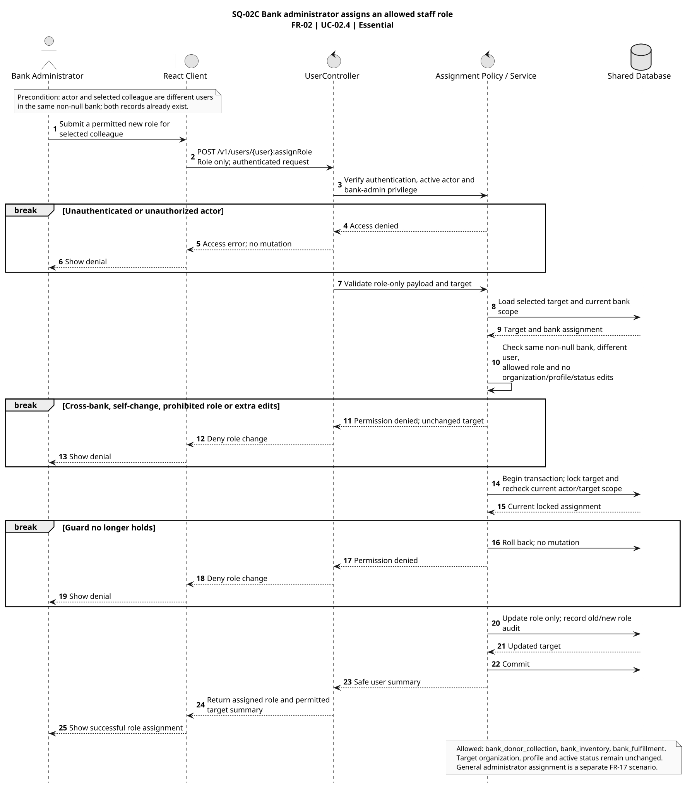
```plantuml
@startuml SQ02C_Assign
title SQ-02C Bank administrator assigns an allowed staff role\nFR-02 | UC-02.4 | Essential
skinparam monochrome true
skinparam shadowing false
skinparam defaultFontName Arial
skinparam defaultFontSize 14
skinparam ArrowFontSize 13
skinparam noteFontSize 12
skinparam dpi 140
hide footbox
skinparam maxMessageSize 240
autonumber
actor "Bank Administrator" as Admin
boundary "React Client" as Client
control UserController as Ctrl
control "Assignment Policy / Service" as Policy
database "Shared Database" as DB
note over Admin, Client
 Precondition: actor and selected colleague are different users
 in the same non-null bank; both records already exist.
end note
Admin -> Client: Submit a permitted new role for selected colleague
Client -> Ctrl: POST /v1/users/{user}:assignRole\nRole only; authenticated request
Ctrl -> Policy: Verify authentication, active actor and bank-admin privilege
break Unauthenticated or unauthorized actor
 Policy --> Ctrl: Access denied
 Ctrl --> Client: Access error; no mutation
 Client --> Admin: Show denial
end
Ctrl -> Policy: Validate role-only payload and target
Policy -> DB: Load selected target and current bank scope
DB --> Policy: Target and bank assignment
Policy -> Policy: Check same non-null bank, different user,\nallowed role and no organization/profile/status edits
break Cross-bank, self-change, prohibited role or extra edits
 Policy --> Ctrl: Permission denied; unchanged target
 Ctrl --> Client: Deny role change
 Client --> Admin: Show denial
end
Policy -> DB: Begin transaction; lock target and\nrecheck current actor/target scope
DB --> Policy: Current locked assignment
break Guard no longer holds
 Policy -> DB: Roll back; no mutation
 Policy --> Ctrl: Permission denied
 Ctrl --> Client: Deny role change
 Client --> Admin: Show denial
end
Policy -> DB: Update role only; record old/new role audit
DB --> Policy: Updated target
Policy -> DB: Commit
Policy --> Ctrl: Safe user summary
Ctrl --> Client: Return assigned role and permitted target summary
Client --> Admin: Show successful role assignment
note over Policy, DB
 Allowed: bank_donor_collection, bank_inventory, bank_fulfillment.
 Target organization, profile and active status remain unchanged.
 General administrator assignment is a separate FR-17 scenario.
end note
@enduml
```

## AD-01A Create bank

Source: [Activity/AD-01A-CreateBank.puml](<Activity/AD-01A-CreateBank.puml>) · [PNG](<Activity/AD-01A-CreateBank.png>)

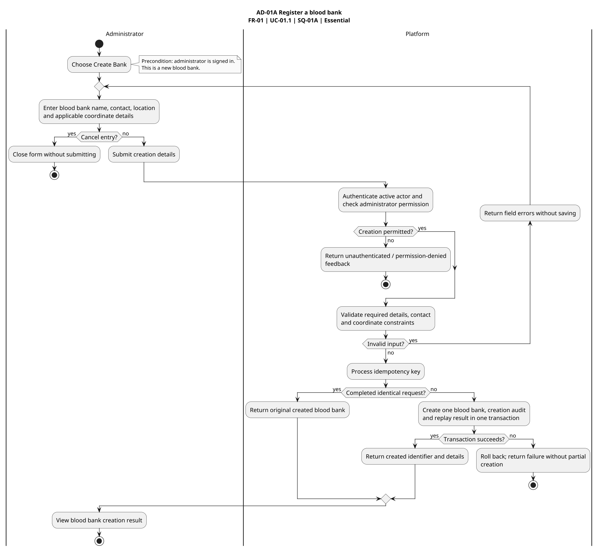
```plantuml
@startuml AD01A_Create
title AD-01A Register a blood bank\nFR-01 | UC-01.1 | SQ-01A | Essential
skinparam monochrome true
skinparam shadowing false
skinparam defaultFontName Arial
skinparam defaultFontSize 14
skinparam ArrowFontSize 13
skinparam noteFontSize 12
skinparam dpi 140
|Administrator|
start
:Choose Create Bank;
note right
 Precondition: administrator is signed in.
 This is a new blood bank.
end note
repeat
 :Enter blood bank name, contact, location\nand applicable coordinate details;
 if (Cancel entry?) then (yes)
  :Close form without submitting;
  stop
 else (no)
  :Submit creation details;
 endif
 |Platform|
 :Authenticate active actor and\ncheck administrator permission;
 if (Creation permitted?) then (yes)
 else (no)
  :Return unauthenticated / permission-denied\nfeedback;
  stop
 endif
 :Validate required details, contact\nand coordinate constraints;
backward:Return field errors without saving;
repeat while (Invalid input?) is (yes) not (no)
:Process idempotency key;
if (Completed identical request?) then (yes)
 :Return original created blood bank;
else (no)
 :Create one blood bank, creation audit\nand replay result in one transaction;
 if (Transaction succeeds?) then (yes)
  :Return created identifier and details;
 else (no)
  :Roll back; return failure without partial\ncreation;
  stop
 endif
endif
|Administrator|
:View blood bank creation result;
stop
@enduml
```

## AD-01B Deactivate organization

Source: [Activity/AD-01B-DeactivateOrganization.puml](<Activity/AD-01B-DeactivateOrganization.puml>) · [PNG](<Activity/AD-01B-DeactivateOrganization.png>)

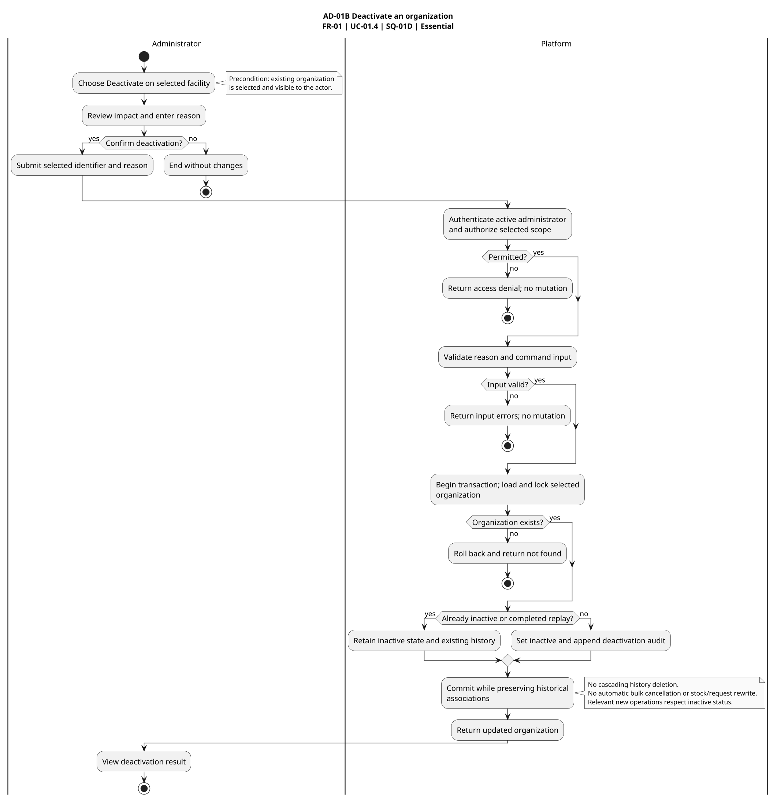
```plantuml
@startuml AD01B_Deactivate
title AD-01B Deactivate an organization\nFR-01 | UC-01.4 | SQ-01D | Essential
skinparam monochrome true
skinparam shadowing false
skinparam defaultFontName Arial
skinparam defaultFontSize 14
skinparam ArrowFontSize 13
skinparam noteFontSize 12
skinparam dpi 140
|Administrator|
start
:Choose Deactivate on selected facility;
note right
 Precondition: existing organization
 is selected and visible to the actor.
end note
:Review impact and enter reason;
if (Confirm deactivation?) then (yes)
 :Submit selected identifier and reason;
else (no)
 :End without changes;
 stop
endif
|Platform|
:Authenticate active administrator\nand authorize selected scope;
if (Permitted?) then (yes)
else (no)
 :Return access denial; no mutation;
 stop
endif
:Validate reason and command input;
if (Input valid?) then (yes)
else (no)
 :Return input errors; no mutation;
 stop
endif
:Begin transaction; load and lock selected\norganization;
if (Organization exists?) then (yes)
else (no)
 :Roll back and return not found;
 stop
endif
if (Already inactive or completed replay?) then (yes)
 :Retain inactive state and existing history;
else (no)
 :Set inactive and append deactivation audit;
endif
:Commit while preserving historical\nassociations;
note right
 No cascading history deletion.
 No automatic bulk cancellation or stock/request rewrite.
 Relevant new operations respect inactive status.
end note
:Return updated organization;
|Administrator|
:View deactivation result;
stop
@enduml
```

## AD-01C Update organization

Source: [Activity/AD-01C-UpdateOrganization.puml](<Activity/AD-01C-UpdateOrganization.puml>) · [PNG](<Activity/AD-01C-UpdateOrganization.png>)

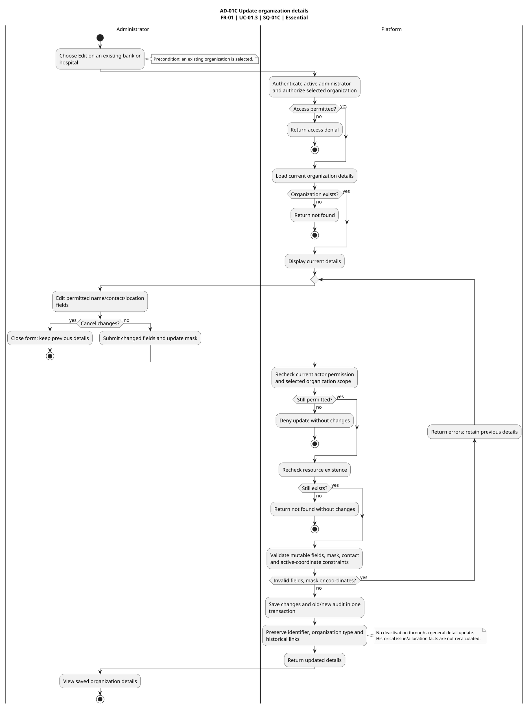
```plantuml
@startuml AD01C_Update
title AD-01C Update organization details\nFR-01 | UC-01.3 | SQ-01C | Essential
skinparam monochrome true
skinparam shadowing false
skinparam defaultFontName Arial
skinparam defaultFontSize 14
skinparam ArrowFontSize 13
skinparam noteFontSize 12
skinparam dpi 140
|Administrator|
start
:Choose Edit on an existing bank or\nhospital;
note right
 Precondition: an existing organization is selected.
end note
|Platform|
:Authenticate active administrator\nand authorize selected organization;
if (Access permitted?) then (yes)
else (no)
 :Return access denial;
 stop
endif
:Load current organization details;
if (Organization exists?) then (yes)
else (no)
 :Return not found;
 stop
endif
:Display current details;
repeat
 |Administrator|
 :Edit permitted name/contact/location\nfields;
 if (Cancel changes?) then (yes)
  :Close form; keep previous details;
  stop
 else (no)
  :Submit changed fields and update mask;
 endif
 |Platform|
 :Recheck current actor permission\nand selected organization scope;
 if (Still permitted?) then (yes)
 else (no)
  :Deny update without changes;
  stop
 endif
 :Recheck resource existence;
 if (Still exists?) then (yes)
 else (no)
  :Return not found without changes;
  stop
 endif
 :Validate mutable fields, mask, contact\nand active-coordinate constraints;
backward:Return errors; retain previous details;
repeat while (Invalid fields, mask or coordinates?) is (yes) not (no)
:Save changes and old/new audit in one\ntransaction;
:Preserve identifier, organization type and\nhistorical links;
note right
 No deactivation through a general detail update.
 Historical issue/allocation facts are not recalculated.
end note
:Return updated details;
|Administrator|
:View saved organization details;
stop
@enduml
```

## AD-01D Create hospital

Source: [Activity/AD-01D-CreateHospital.puml](<Activity/AD-01D-CreateHospital.puml>) · [PNG](<Activity/AD-01D-CreateHospital.png>)

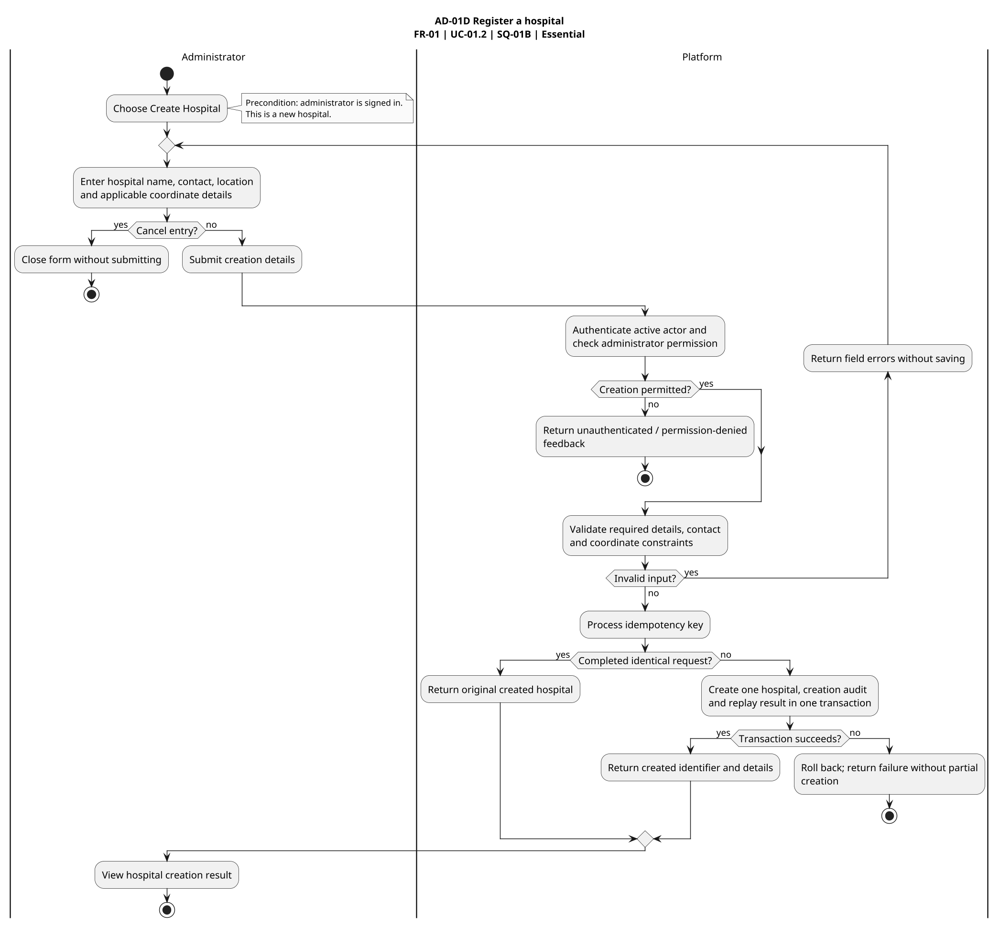
```plantuml
@startuml AD01D_Create
title AD-01D Register a hospital\nFR-01 | UC-01.2 | SQ-01B | Essential
skinparam monochrome true
skinparam shadowing false
skinparam defaultFontName Arial
skinparam defaultFontSize 14
skinparam ArrowFontSize 13
skinparam noteFontSize 12
skinparam dpi 140
|Administrator|
start
:Choose Create Hospital;
note right
 Precondition: administrator is signed in.
 This is a new hospital.
end note
repeat
 :Enter hospital name, contact, location\nand applicable coordinate details;
 if (Cancel entry?) then (yes)
  :Close form without submitting;
  stop
 else (no)
  :Submit creation details;
 endif
 |Platform|
 :Authenticate active actor and\ncheck administrator permission;
 if (Creation permitted?) then (yes)
 else (no)
  :Return unauthenticated / permission-denied\nfeedback;
  stop
 endif
 :Validate required details, contact\nand coordinate constraints;
backward:Return field errors without saving;
repeat while (Invalid input?) is (yes) not (no)
:Process idempotency key;
if (Completed identical request?) then (yes)
 :Return original created hospital;
else (no)
 :Create one hospital, creation audit\nand replay result in one transaction;
 if (Transaction succeeds?) then (yes)
  :Return created identifier and details;
 else (no)
  :Roll back; return failure without partial\ncreation;
  stop
 endif
endif
|Administrator|
:View hospital creation result;
stop
@enduml
```

## AD-01E View organizations

Source: [Activity/AD-01E-ViewOrganizations.puml](<Activity/AD-01E-ViewOrganizations.puml>) · [PNG](<Activity/AD-01E-ViewOrganizations.png>)

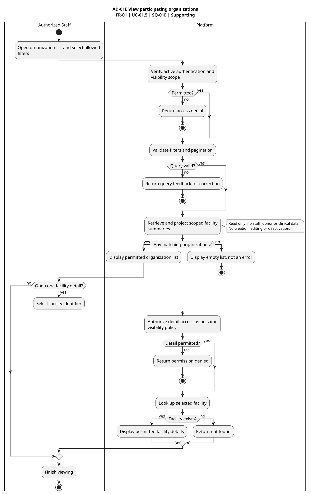
```plantuml
@startuml AD01E_View
title AD-01E View participating organizations\nFR-01 | UC-01.5 | SQ-01E | Supporting
skinparam monochrome true
skinparam shadowing false
skinparam defaultFontName Arial
skinparam defaultFontSize 14
skinparam ArrowFontSize 13
skinparam noteFontSize 12
skinparam dpi 140
|Authorized Staff|
start
:Open organization list and select allowed\nfilters;
|Platform|
:Verify active authentication and\nvisibility scope;
if (Permitted?) then (yes)
else (no)
 :Return access denial;
 stop
endif
:Validate filters and pagination;
if (Query valid?) then (yes)
else (no)
 :Return query feedback for correction;
 stop
endif
:Retrieve and project scoped facility\nsummaries;
note right
 Read only; no staff, donor or clinical data.
 No creation, editing or deactivation.
end note
if (Any matching organizations?) then (yes)
 :Display permitted organization list;
else (no)
 :Display empty list, not an error;
 stop
endif
|Authorized Staff|
if (Open one facility detail?) then (yes)
 :Select facility identifier;
 |Platform|
 :Authorize detail access using same\nvisibility policy;
 if (Detail permitted?) then (yes)
 else (no)
  :Return permission denied;
  stop
 endif
 :Look up selected facility;
 if (Facility exists?) then (yes)
  :Display permitted facility details;
 else (no)
  :Return not found;
 endif
else (no)
endif
|Authorized Staff|
:Finish viewing;
stop
@enduml
```

## AD-02 Authorize one protected operation

Source: [Activity/AD-02-AccessCheck.puml](<Activity/AD-02-AccessCheck.puml>) · [PNG](<Activity/AD-02-AccessCheck.png>)

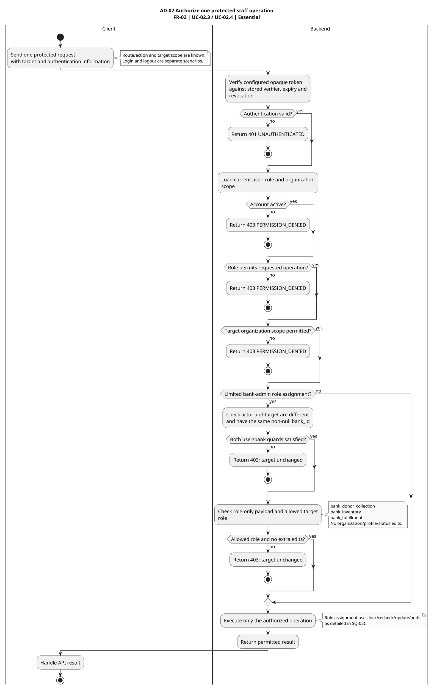
```plantuml
@startuml AD02_Authorize
title AD-02 Authorize one protected staff operation\nFR-02 | UC-02.3 / UC-02.4 | Essential
skinparam monochrome true
skinparam shadowing false
skinparam defaultFontName Arial
skinparam defaultFontSize 14
skinparam ArrowFontSize 13
skinparam noteFontSize 12
skinparam dpi 140
|Client|
start
:Send one protected request\nwith target and authentication information;
note right
 Route/action and target scope are known.
 Login and logout are separate scenarios.
end note
|Backend|
:Verify configured opaque token\nagainst stored verifier, expiry and\nrevocation;
if (Authentication valid?) then (yes)
else (no)
 :Return 401 UNAUTHENTICATED;
 stop
endif
:Load current user, role and organization\nscope;
if (Account active?) then (yes)
else (no)
 :Return 403 PERMISSION_DENIED;
 stop
endif
if (Role permits requested operation?) then (yes)
else (no)
 :Return 403 PERMISSION_DENIED;
 stop
endif
if (Target organization scope permitted?) then (yes)
else (no)
 :Return 403 PERMISSION_DENIED;
 stop
endif
if (Limited bank-admin role assignment?) then (yes)
 :Check actor and target are different\nand have the same non-null bank_id;
 if (Both user/bank guards satisfied?) then (yes)
 else (no)
  :Return 403; target unchanged;
  stop
 endif
 :Check role-only payload and allowed target\nrole;
 note right
  bank_donor_collection
  bank_inventory
  bank_fulfillment
  No organization/profile/status edits.
 end note
 if (Allowed role and no extra edits?) then (yes)
 else (no)
  :Return 403; target unchanged;
  stop
 endif
else (no)
endif
:Execute only the authorized operation;
note right
 Role assignment uses lock/recheck/update/audit
 as detailed in SQ-02C.
end note
:Return permitted result;
|Client|
:Handle API result;
stop
@enduml
```
